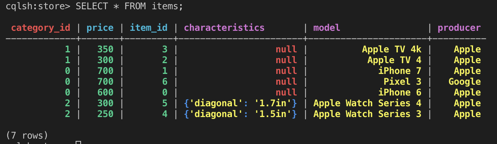

## Task 3 - Neo4j

by Teodor Romanus

#### Run commands

```
docker run --name disdat-cassandra-1 -d cassandra:latest
```
```
docker run -it --link disdat-cassandra-1:cassandra --rm cassandra cqlsh cassandra
```

```
DROP KEYSTORE store;

CREATE KEYSPACE store
  WITH REPLICATION = { 
   'class' : 'SimpleStrategy', 
   'replication_factor' : 1 
  };

USE store;
```

#### Аналогічно завданням по MongoDB Вам необхідно змоделювати інтернет-магазина торгує різноманітними товарами (тобто у яких різний набір властивостей) - таблиця items. Необхідно, щоб пошук швидко працював для визначенної категорії товарів

```
DROP TABLE items;

CREATE TABLE items (
    item_id int, 
    category_id int, 
    model text, 
    producer text, 
    price float, 
    characteristics map<text,text>, 
    PRIMARY KEY((category_id), price, item_id)
    ) WITH CLUSTERING ORDER BY (price DESC);

CREATE CUSTOM INDEX imodel ON items (model) USING 'org.apache.cassandra.index.sasi.SASIIndex' WITH OPTIONS = {'analyzer_class': 'org.apache.cassandra.index.sasi.analyzer.StandardAnalyzer', 'case_sensitive': 'false'};

CREATE CUSTOM INDEX iproducer ON items (producer) USING 'org.apache.cassandra.index.sasi.SASIIndex' WITH OPTIONS = {'analyzer_class': 'org.apache.cassandra.index.sasi.analyzer.StandardAnalyzer', 'case_sensitive': 'false'};

INSERT INTO items (item_id, category_id, model, producer, price, characteristics)
  VALUES (0, 0, 'iPhone 6', 'Apple', 600, {});

INSERT INTO items (item_id, category_id, model, producer, price, characteristics)
  VALUES (1, 0, 'iPhone 7', 'Apple', 700, {});

INSERT INTO items (item_id, category_id, model, producer, price, characteristics)
  VALUES (2, 1, 'Apple TV 4', 'Apple', 300, {});

INSERT INTO items (item_id, category_id, model, producer, price, characteristics)
  VALUES (3, 1, 'Apple TV 4k', 'Apple', 350, {});

INSERT INTO items (item_id, category_id, model, producer, price, characteristics)
  VALUES (4, 2, 'Apple Watch Series 3', 'Apple', 250, {'diagonal':'1.5in'});

INSERT INTO items (item_id, category_id, model, producer, price, characteristics)
  VALUES (5, 2, 'Apple Watch Series 4', 'Apple', 300, {'diagonal':'1.7in'});

INSERT INTO items (item_id, category_id, model, producer, price, characteristics)
  VALUES (6, 0, 'Pixel 3', 'Google', 700, {});
```
<!--  -->

#### 1.	Напишіть запит, який показує структуру створеної таблиці (команда DESCRIBE)

```
DESCRIBE items
```

#### 2. Напишіть запит, який виведіть усі товари в певній категорії відсортовані за ціною

```
SELECT * FROM items WHERE category_id = 0;
```

#### 3. Напишіть запити, які вибирають товари за різними критеріями в межах певної категорії: назва,  ціна (в проміжку), ціна та виробник

```
SELECT * FROM items WHERE category_id = 0 AND model LIKE 'iPhone%';
```

```
SELECT * FROM items WHERE category_id = 0 AND price > 550 and price < 650;
```

```
SELECT * FROM items WHERE category_id = 0 AND price > 650 AND producer LIKE 'Google';
```

#### 4. Напишіть запити, які вибирають товари за: наявність певних характеристик; певна характеристика та її значення

```
SELECT * FROM items WHERE characteristics CONTAINS KEY 'diagonal' ALLOW FILTERING;
```

```
SELECT * FROM items WHERE characteristics CONTAINS KEY 'diagonal' AND characteristics['diagonal'] = '1.5in' ALLOW FILTERING;
```

#### 5. Оновить опис товару: змінить існуючі значення певної характеристики; додайте нові властивості (характеристики) товару; видалить характеристику товару

```
UPDATE items SET characteristics=characteristics + {'diagonal':'1.69in'} WHERE category_id=2 AND item_id=5 AND price=300;
```

```
UPDATE items SET characteristics=characteristics + {'diagonal':'4.7in'} WHERE category_id=0 AND item_id=0 AND price=600;
```

```
DELETE characteristics['diagonal'] FROM items WHERE category_id=0 AND item_id=0 AND price=600;
```

#### Створіть таблицю orders в якій міститься ім'я замовника і інформація про замовлення. Для кожного замовника повинна бути можливість швидко шукати його замовлення і виконувати по них запити. Саме замовлення містить вартість, дату і набір товарів
```
CREATE TYPE Item(
   category_id int,
   item_id int,
   price float
);
```

```
DROP TABLE orders;

CREATE TABLE orders (
    order_id int,
    user_name text, 
    sum float, 
    created timestamp, 
    items list<FROZEN<Item>>, 
    PRIMARY KEY((user_name), created, order_id)
    ) WITH CLUSTERING ORDER BY (created ASC);

CREATE INDEX iitems ON orders (items);

INSERT INTO orders JSON'{"order_id":0, "user_name":"Tim Apple", "sum":1300, "created":"1552325201000", "items": [{"category_id":0, "item_id":0, "price":600}, {"category_id":0, "item_id":1, "price":700}]}';

INSERT INTO orders JSON'{"order_id":1, "user_name":"Tim Apple", "sum":250, "created":"1552325202000", "items": [{"category_id":2, "item_id":4, "price":250}]}';

INSERT INTO orders JSON'{"order_id":2, "user_name":"Elon Tesla", "sum":250, "created":"1552325203000", "items": [{"category_id":2, "item_id":4, "price":250}]}';
```

#### 1. Напишіть запит, який показує структуру створеної таблиці (команда DESCRIBE)

```
DESCRIBE orders;
```

#### 2. Для замовника виведіть всі його замовлення відсортовані за часом коли вони були зроблені

```
SELECT * FROM orders WHERE user_name = 'Tim Apple';
```

#### 3. Для замовника знайдіть замовлення з певним товаром

```
SELECT * FROM orders WHERE user_name = 'Tim Apple' AND items CONTAINS {"category_id":0, "item_id":0, "price":600} ALLOW FILTERING;
```

#### 4. Для замовника знайдіть замовлення за певний період і їх кількість

```
SELECT * FROM orders WHERE user_name = 'Tim Apple' AND created > 1552325200000 AND created < 1552325203000;
```

```
SELECT COUNT(*) FROM orders WHERE user_name = 'Tim Apple' AND created > 1552325200000 AND created < 1552325203000;
```

#### 5. Для кожного замовників визначте середню вартість замовлення

```
SELECT user_name, AVG(sum) FROM orders GROUP BY user_name;
```

#### 6. Для кожного замовників визначте суму на яку були зроблені усі його замовлення

```
SELECT user_name, SUM(sum) FROM orders GROUP BY user_name;
```

#### 7. Для кожного замовників визначте замовлення з максимальною вартістю

```
???
```

#### 8. Модифікуйте певне замовлення додавши / видаливши один або кілька товарів при цьому також змінюючи вартість замовлення

```
UPDATE orders SET items=items + [{"category_id":2, "item_id":4, "price":250}], sum=1550 WHERE user_name = 'Tim Apple' AND order_id = 0 AND created = '1552325201000';
```

#### 9. Для кожного замовлення виведіть час коли його ціна були занесена в базу (SELECT WRITETIME)

```
SELECT user_name, order_id, sum, WRITETIME(sum) FROM orders;
```

#### 10. Створіть замовлення з певним часом життя (TTL), після якого воно видалиться 

```
INSERT INTO orders JSON'{"order_id":3, "user_name":"Elon Tesla", "sum":300, "created":"1552325204000", "items": [{"category_id":2, "item_id":5, "price":300}]}' USING TTL 86400;
```

#### 11. Поверніть замовлення у форматі JSON

```
SELECT JSON * FROM orders WHERE user_name = 'Tim Apple' AND order_id = 0 AND created = '1552325201000'; 
```

#### 12. Додайте замовлення у форматі JSON

```
GOTO: 'orders' table creation
```


