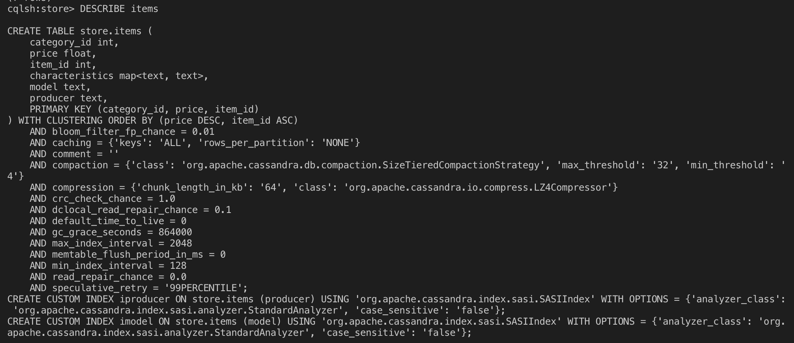

## Task 3 - Neo4j

by Teodor Romanus

#### Run commands

```
docker run --name disdat-cassandra-1 -d cassandra:latest
```
```
docker run -it --link disdat-cassandra-1:cassandra --rm cassandra cqlsh cassandra
```
```
CREATE KEYSPACE store
  WITH REPLICATION = { 
   'class' : 'SimpleStrategy', 
   'replication_factor' : 1 
  };
```
```
USE store;
```

#### Database structure

```
CREATE TABLE items (item_id int PRIMARY KEY, category text, model text, producer text, price float, characteristics map<text,text>);

INSERT INTO items (item_id, category, model, producer, price, characteristics)
  VALUES (0, 'Phone', 'iPhone 6', 'Apple', 600, {});
```

#### 1.	Напишіть запит, який показує структуру створеної таблиці (команда DESCRIBE)

```
DESCRIBE items
```

